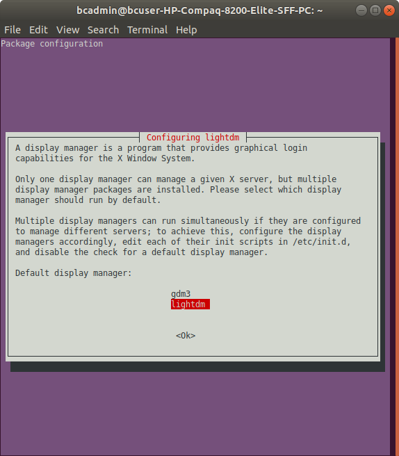

# BitCurator setup notes

Below setup notes describe how to set up BitCurator with MATE as a replacement for the default GNOME desktop (useful for those who prefer a more traditional menu-based desktop). Tested with BitCurator 2.0.6.

1. Install BitCurator from the latest ISO at <https://github.com/BitCurator/bitcurator-distro/wiki/Releases>

2. Install the MATE desktop using the below commands:

        sudo apt update
        sudo apt install ubuntu-mate-desktop

3. When the *package configuration* dialog pops up, select the *lightdm* display manager:

    

4. Once the installation has finished, reboot the machine.

6. To make the BitCurator-specific context menus work, copy the *scripts* folder in `/home/bcadmin/.local/share/nautilus` to `/home/bcadmin/.config/caja`:

        cp -a /home/bcadmin/.local/share/nautilus/scripts /home/bcadmin/.config/caja/scripts

## Additional software

- Pinta (lightweight image editor, useful for e.g. editing/cropping screen shots):

        sudo apt install pinta

- Visual Studio Code (useful for taking notes and writing documentation thanks to good Markdown support)
