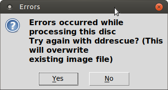
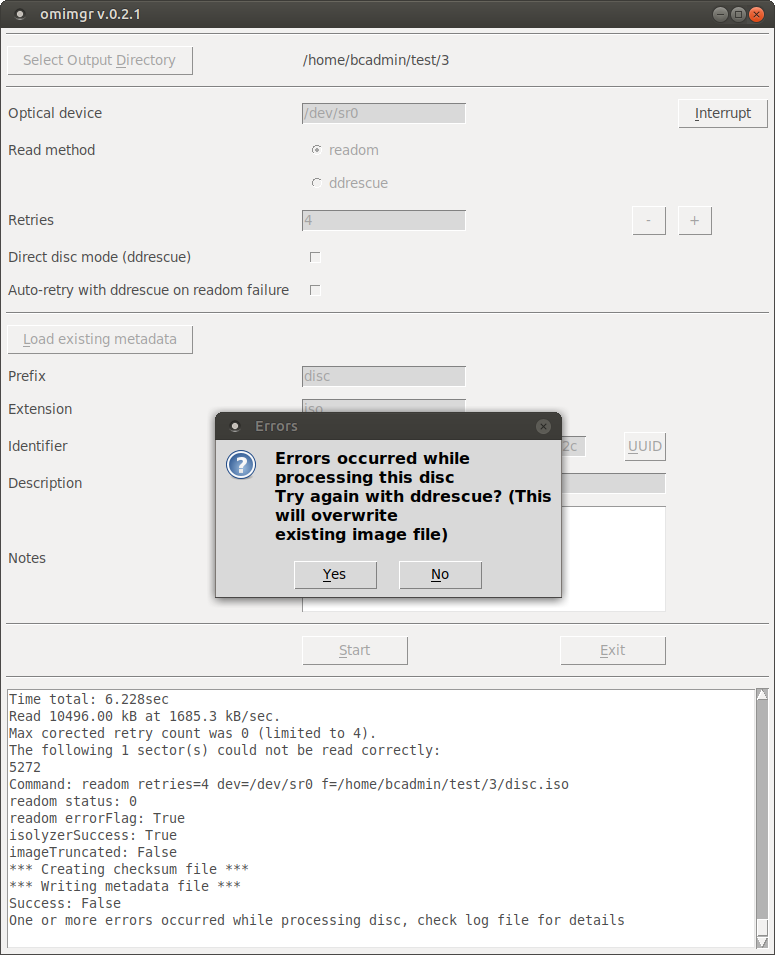

# CD-ROM / DVD

## Introduction

[CD-ROMs](https://www.wikidata.org/wiki/Q7982) (including [CD-Rs](https://www.wikidata.org/wiki/Q420778)) and [DVDs](https://www.wikidata.org/wiki/Q5294) (including [DVD-Rs](https://www.wikidata.org/wiki/Q1071697)) are optical media carriers that contain digital data.

## Hardware

### CD / DVD reader

Can be an internal or external drive, or both. Having multiple drives can be useful for recovering data from defective discs. It is not uncommon to find that sectors give read errors in one drive are read correctly by another one (and vice versa), and the software workflow can take advantage of this (see below).

## Software

[omimgr](https://github.com/KBNLresearch/omimgr), running in [BitCurator](https://bitcurator.net/).

## Procedure for reading a disc

1. Start *omimgr* from the OS's main menu (in Ubuntu 18.04 the *omimgr* item is located under *System Tools*).

    

2. Use the *Select Output Directory* button to navigate to an empty directory where the disc image and its associated metadata will be stored (or create a new directory from the dialog).

3. If you are using an external CD or DVD drive, you may need to change the *Optical device* value accordingly (a typical value for an external device would be `/dev/sr1`).

4. Leave *Read method*, *Retries*, *Direct disc mode* and *Auto-retry* at their default values.

5. Click on the *UUID* button to generate a unique identifier.

6. Use the *Description* field to enter a description of the disc (e.g. the title that is written on its label or inlay card). Optionally, use the *Notes* field to record anything else worth mentioning about the disc (e.g. if the *Description* is ambiguous because the writing on the disc is illegible, make a note of it here).

7. Insert the disc into the drive, close it, and wait for the disc to mount (a file manager window pops up when the disc is mounted ).

9. Press the *Start* button to start imaging, and then wait for *omimgr* to finish. You can monitor the progress of the imaging procedure in the progress window:

    

    Note that the screen output is also written to a log file in the output directory. If the imaging finished without any errors, the following prompt appears:

    

    The output directory now contains the following files:

    

    Here, **disc.iso** is the ISO image; **checksums.sha512** contains the SHA512 checksum of the image file, **metadata.json** contains some basic metadata and **omimgr.log** is the log file.

10. If the imaging procedure *did* result in any errors, follow the *Additional steps in case of errors* section below. Otherwise, take out the disc.

## Additional steps in case of errors

If the reading of the disc with *readom* resulted in errors, the following prompt will appear:

If this happens, follow the steps below.

1. Have a careful look at the text you see in the progress window. In particular, look at the error message that is reported by *readom*, and the value of *imageTruncated*.

    

    In this case we see that only 1 sector could not be read (`The following 1 sector(s) could not be read correctly`). This is a common problem with recordable CDs, which often result in problems with the final 1 or 2 sectors. In most cases these sectors do not contain any meaningful data. This is confirmed by the value of *imageTruncated* (`imageTruncated: False`), which means the imaging result is most likely OK, in which case it's safe to click on *No*, and take out the disc.

2. If *readom* reports more extensive problems, and the value of *imageTruncated* is *True*, click *Yes*. *Omimgr* will now delete the current image file, and retry imaging the disc with the *ddrescue* tool (which is often better at recovering data from defective media). Note that, depending on the condition of the disc, *ddrescue* may need up to several hours to read it!

3. If *omimgr* still reports errors after the first pass with *ddrescue*, you can run additional passes to improve the result. Try re-running it in *Direct disc* mode (which can be selected from *omimgr*'s interface). Another useful technique is to run additional *ddrescue* passes with different optical devices (e.g. one or more external USB drives).

<!--TODO elaborate a bit on this, add screenshots-->

4. Take out the disc. All done!

## Interrupting readom or ddrescue

Running imaging processes can be stopped by pressing the *Interrupt* button. This is particularly useful for *ddrescue* runs, which may require many hours for discs that are badly damaged. Note that interrupting *ddrescue* will not result in any data loss, and interrupted runs can be resumed at a later time (see below). Interrupting *readom* will generally result in an unreadable ISO image, and is not advised.

## Resuming an interrupted ddrescue run

Follow these steps to resume a *ddrescue* run that was previously interrupted:

1. After launching *omimgr*, set the output directory to the directory of the interrupted run.

2. Set **Read method** to *ddrescue*.

3. Click on the **Load existing metadata** button; this loads the previously entered *Prefix*, *Extension*, *Identifier*, *Description* and *Notes* values.

4. Hit the **Start** button. Now *ddrescue* will simply pick up on where the interrupted run stopped.
