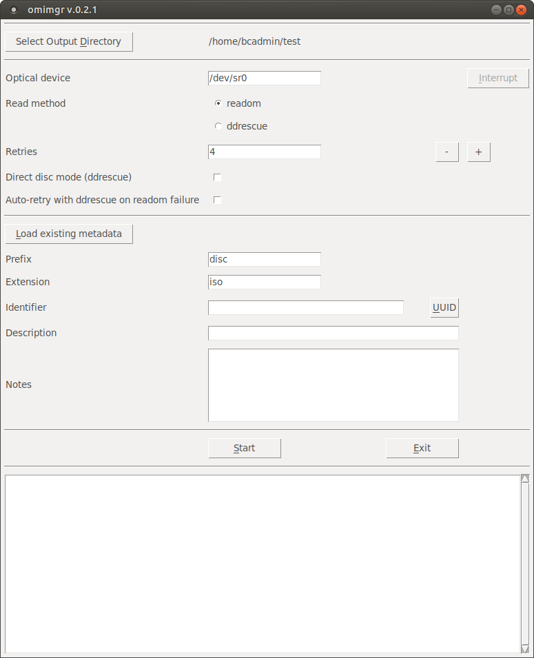
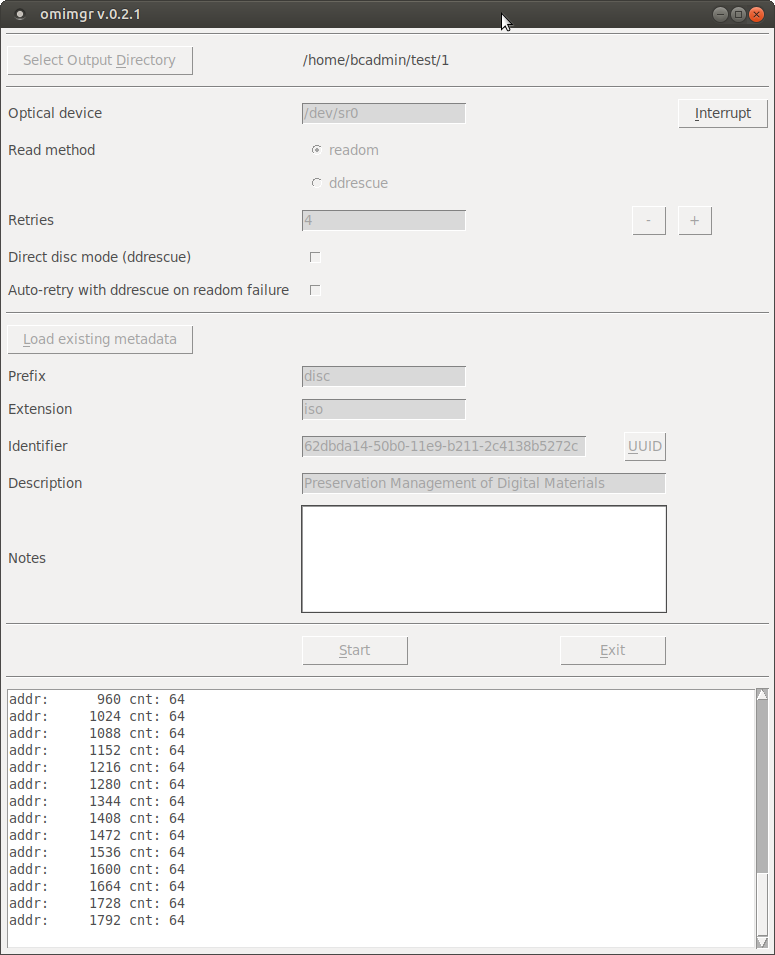
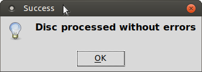
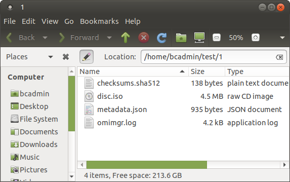

# CD-ROM / DVD

## Introduction

[CD-ROMs](https://www.wikidata.org/wiki/Q7982) (including [CD-Rs](https://www.wikidata.org/wiki/Q420778)) and [DVDs](https://www.wikidata.org/wiki/Q5294) (including [DVD-Rs](https://www.wikidata.org/wiki/Q1071697)) are optical media carriers that contain digital data.

## Hardware

### CD / DVD reader

Can be an internal or external drive, or both. Having multiple drives can be useful for recovering data from defective discs. It is not uncommon to find that sectors give read errors in one drive are read correctly by another one (and vice versa), and the software workflow can take advantage of this (see below).

## Software

[omimgr](https://github.com/KBNLresearch/omimgr), running in [BitCurator](https://bitcurator.net/).

## Procedure for reading a disc

1. Start *omimgr* from the OS's main menu (in Ubuntu 18.04 the *omimgr* item is located under *System Tools*).

    

2. Use the *Select Output Directory* button to navigate to an empty directory where the disc image and its associated metadata will be stored (or create a new directory from the dialog).

3. If you are using an external CD or DVD drive, you may need to change the *Optical device* value accordingly (a typical value for an external device would be `/dev/sr1`).

4. Leave *Read method*, *Retries*, *Direct disc mode* and *Auto-retry* at their default values.

5. Click on the *UUID* button to generate a unique identifier.

6. Use the *Description* field to enter a description of the disc (e.g. the title that is written on its label or inlay card). Optionally, use the *Notes* field to record anything else worth mentioning about the disc (e.g. if the *Description* is ambiguous because the writing on the disc is illegible, make a note of it here).

7. Insert the disc into the drive, close it, and wait for the disc to mount (a file manager window pops up when the disc is mounted ).

9. Press the *Start* button to start imaging, and then wait for *omimgr* to finish. You can monitor the progress of the imaging procedure in the progress window:

    

    Note that the screen output is also written to a log file in the output directory. A prompt appears when the extraction has finished:

    

    If the extraction finished without any errors, the output directory now contains the following files:

    

    Here, **disc.iso** is the ISO image; **checksums.sha512** contains the SHA512 checksum of the image file, **metadata.json** contains some basic metadata and **omimgr.log** is the log file.

11. Take out the disc. All done!

