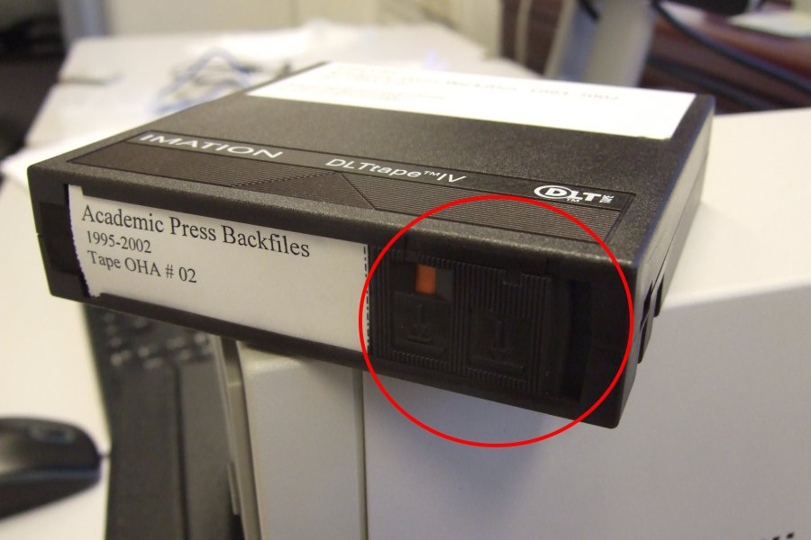

# CD-ROM / DVD

## Introduction

[CD-ROMs](https://www.wikidata.org/wiki/Q7982) (including [CD-Rs](https://www.wikidata.org/wiki/Q420778)) and [DVDs](https://www.wikidata.org/wiki/Q5294) (including [DVD-Rs](https://www.wikidata.org/wiki/Q1071697)) are optical media carriers that contain digital data.

## Hardware

### CD / DVD reader

Can be an internal or external drive, or both. Having multiple drives can be useful for recovering data from defective discs. It is not uncommon to find that sectors give read errors in one drive are read correctly by another one (and vice versa), and the software workflow can take advantage of this (see below).

## Software

[omimgr](https://github.com/KBNLresearch/omimgr), running in [BitCurator](https://bitcurator.net/).

## Procedure for reading a disc

1. Start *omimgr* from the OS's main menu (in Ubuntu 18.04 the *tapeimgr* item is located under *System Tools*).

    

1. Check the write-protect tab on the bottom of the cartridge, and slide it to the leftmost position. The orange indicator must be visible:

    

6. Create an empty directory for storing the extracted tape contents.

8. Use the *Select Output Directory* button to navigate to the empty directory created under step 6. Click on the *UUID* button to generate a unique identifier. Use the *Description* field to enter a description of the tape (e.g. the title that is written on its label or inlay card). Optionally, use the *Notes* field to record anything else worth mentioning about the tape (e.g. if the *Description* is ambiguous because the writing on the tape's label is illegible, make a note of it here).

9. Press the *Start* button to start the extraction, and then wait for *tapeimgr* to finish (depending on the amount of data on the tape this may take several hours). You can monitor the progress of the extraction procedure in the progress window:

    

    Note that the screen output is also written to a log file in the output directory. A prompt appears when the extraction has finished:

    

    If the extraction finished without any errors, the output directory now contains the following files:

    

    Here, **file000001.dd** through **file000003.dd** are the extracted files; **checksums.sha512** contains the SHA512 checksums of the extracted files, **metadata.json** contains some basic metadata and **tapeimgr.log** is the log file.

10. When *tapeimgr* has finished, wait until the "tape in use" indicator light stops blinking, and the green "operate handle" light (bottom-right) comes on. Now lift the cartridge insert/release handle:

    

11. Take out the tape cartridge. All done!

Make sure to lower the insert/release handle again at the end of your tape reading session (i.e. before switching off the tape reader). 
