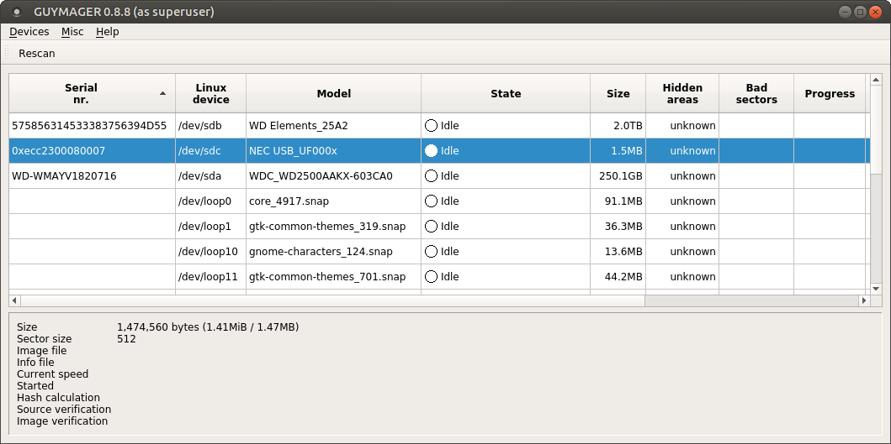
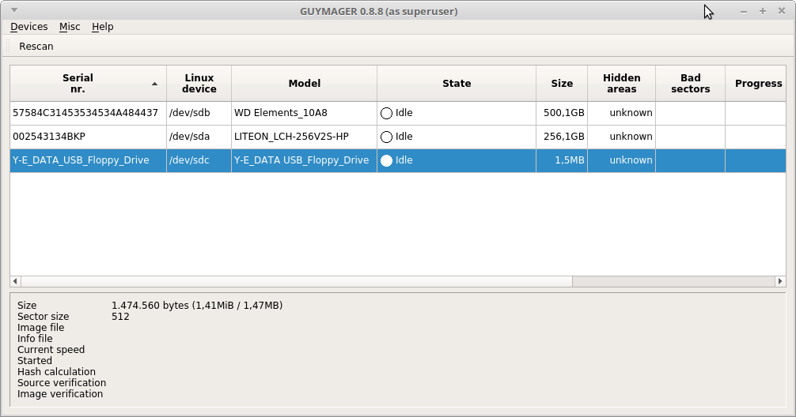
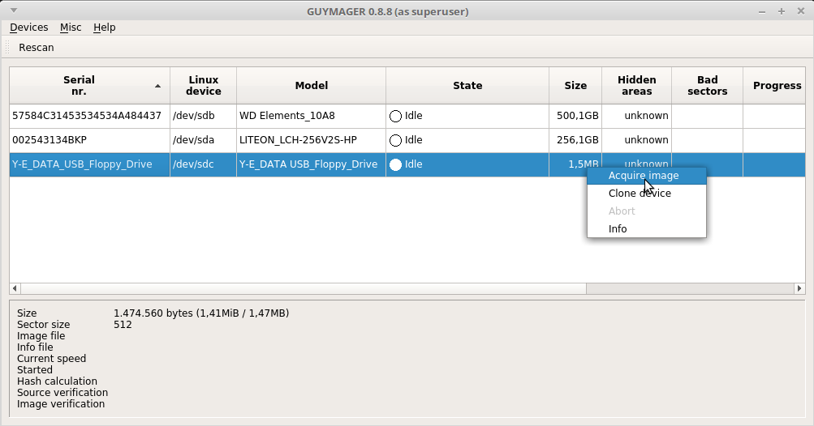
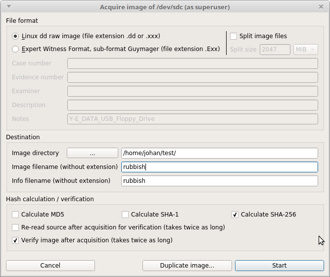
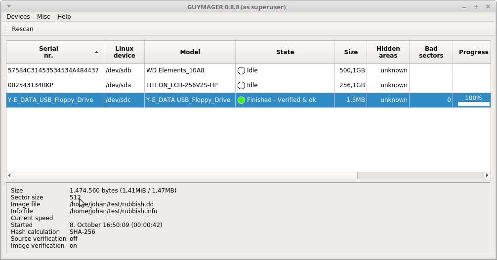

# 3.5" floppy disk

## Introduction

[3.5" floppy disk](https://en.wikipedia.org/wiki/Floppy_disk#%E2%80%8B3_1%E2%81%842-inch_floppy_disk) .

## Floppy reader

|**Model**|[BaseTech USB Floppy Disk Drive refurbished](https://web.archive.org/web/20181008141513/http://www.produktinfo.conrad.com/datenblaetter/1100000-1199999/001170561-an-01-ml-BASETECH_FLOPPY_LAUFWERK_USB_de_en_fr_nl.pdf)|
|:--|:--|
|**Connection**|USB 2.0/1.1|
|**Type of floppy disk**|High Density (2HD) 1.44 MByte,Normal Density (2DD), 720 kByte|

## Procedure for reading a tape

### Guymager

1. Start Guymager. Result:

    

2. Make sure the floppy's square write-protection tab is enabled (the hole in the corner of the disk must be uncovered).

3. Insert the floppy into the reader.

4. Press the *rescan* button in Guymager (top). Result:

    

5. In Guymager, click on the entry for the floppy device. Result:

    

6. Right-click and select *Acquire image*:

    

7. In the *Acquire image* dialog, make the following settings:

    - Set *File format* to *Linux dd raw*.
    - Uncheck the *Split image files* checkbox.
    - Select the destination directory for the disk image, and enter a file name (without extension).
    - Check *Calculate SHA-256* (and uncheck the *MD5* and *SHA-1* options).
    - Check *Verify image after acquisition*.

    

8. Press the *Start* button and watch the progress indicator.

9. If all went well, the *State* field will read *Finished - Verified & ok*.

    

The above steps result in two files:

- A file with extension *.dd*, which is the actual disk image.
- A file with extension *.info*, which contains information about the imaging process.
