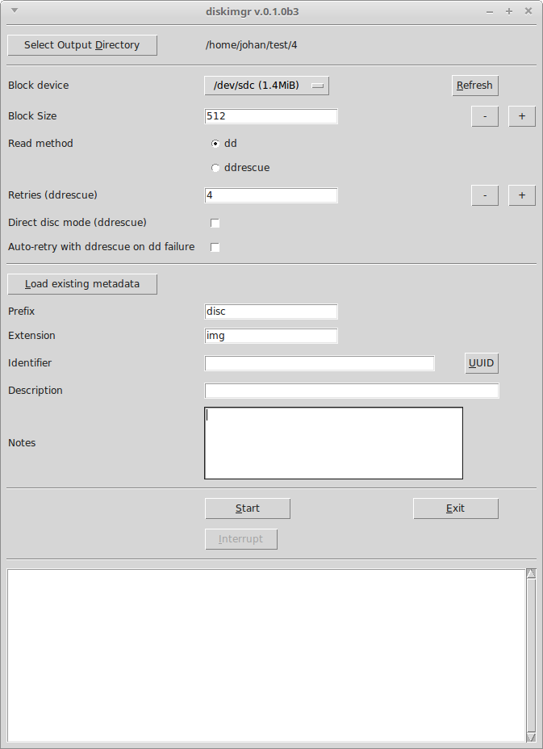
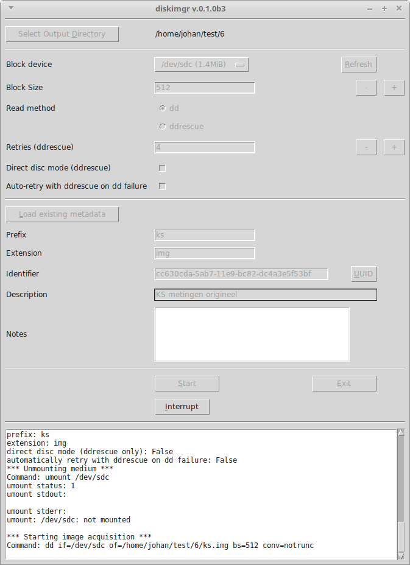
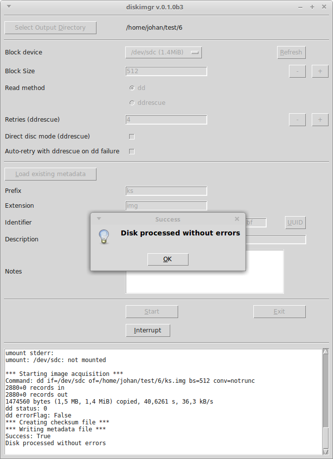
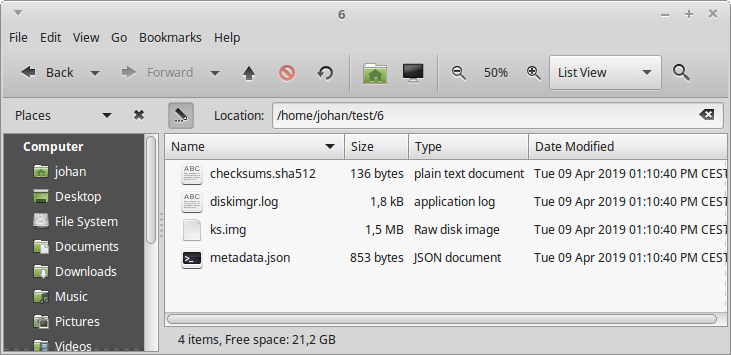
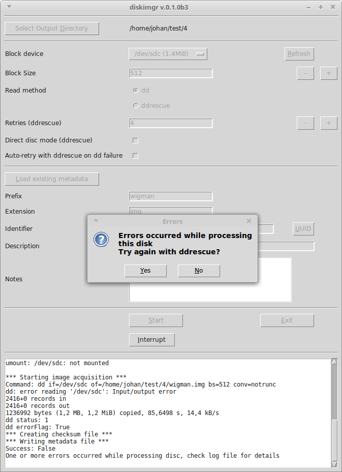

# 3.5" floppy disk

## Introduction

[3.5" floppy disk](https://en.wikipedia.org/wiki/Floppy_disk#%E2%80%8B3_1%E2%81%842-inch_floppy_disk) .

## Hardware

### Floppy disk drive

|**Model**|[BaseTech USB Floppy Disk Drive refurbished](https://web.archive.org/web/20181008141513/http://www.produktinfo.conrad.com/datenblaetter/1100000-1199999/001170561-an-01-ml-BASETECH_FLOPPY_LAUFWERK_USB_de_en_fr_nl.pdf)|
|:--|:--|
|**Connection**|USB 2.0/1.1|
|**Type of floppy disk**|High Density (2HD) 1.44 MByte,Normal Density (2DD), 720 kByte|

### Write blocker

|**Model**|[Tableau Forensic USB 3.0 Bridge](https://www.guidancesoftware.com/tableau/hardware/t8u)|
|:--|:--|
|**Connectors: Host (Left) Side**|USB 3.0 Standard-B connector|
|**Connectors: Device (Right) Side**|USB 3.0 Standard-A connector|

## Connecting the write blocker

1. Hook up the write blocker to the workstation using the blue USB cable (use the left-hand port on the write blocker).

2. Connect the write blocker' s power supply to the DC In (at top) and make sure the power cord is plugged into to a power socket.

## Software

## Software

[diskimgr](https://github.com/KBNLresearch/diskimgr), running in [BitCurator](https://bitcurator.net/).

## Procedure for creating a disk image

1. Connect the floppy disk drive to the right-hand USB connector on the write blocker.

2. Make sure the floppy's square write-protection tab is enabled (the hole in the corner of the disk must be uncovered).

3. Start *diskimgr* from the OS's main menu (in Ubuntu 18.04 the *diskimgr* item is located under *System Tools*).

    

4. Use the *Select Output Directory* button to navigate to an empty directory where the disk image and its associated metadata will be stored (or create a new directory from the dialog).

5. Click on the *UUID* button to generate a unique identifier.

6. Change the *Prefix* value to the name you want to give to the image file, and use the *Description* field to enter a description of the floppy (e.g. the title or description that is written on its label). Optionally, use the *Notes* field to record anything else worth mentioning about the floppy (e.g. if the *Description* is ambiguous because the writing on label is illegible, make a note of it here).

7. Insert the floppy into the drive, and press *diskimgr*'s *Refresh* button.

8. Now select the floppy from the *Block device* drop-down menu (you can usually identify it by its size, which is 1.4 MiB for a High-Density disc, and 720 KiB for a Double-Density disc).

9. Press the *Start* button to start imaging, and then wait for *diskimgr* to finish. You can monitor the progress of the imaging procedure in the progress window:

    

    Note that the screen output is also written to a log file in the output directory. If the imaging finished without any errors, the following prompt appears:

    

    The output directory now contains the following files:

    

    Here, **ks.img** is the ISO image; **checksums.sha512** contains the SHA512 checksum of the image file, **metadata.json** contains some basic metadata and **diskimgr.log** is the log file.

10. If the imaging procedure *did* result in any errors, follow the *Additional steps in case of errors* section below. Otherwise, take out the floppy.

## Additional steps in case of errors

If the reading of the floppy with *dd* resulted in errors, the following prompt will appear:

If this happens, follow these steps:

1. Click *Yes*. *Diskimgr* will now move the current image file to a subdirectory *dd-failed*, and retry imaging the disc with the *ddrescue* tool (which is often better at recovering data from defective media).

2. If *diskimgr* still reports errors after the first pass with *ddrescue*, you can run additional passes to improve the result. Try re-running it in *Direct disc* mode (which can be selected from *diskimgr*'s interface). Another useful technique is to run additional *ddrescue* passes with a different floppy drive.

<!--TODO elaborate a bit on this, add screenshots-->

3. Take the floppy out of the drive after the last *ddrescue* pass. All done!

## Interrupting ddrescue

Running imaging processes can be stopped by pressing the *Interrupt* button. This is particularly useful for *ddrescue* runs, which may require a long time for floppies that are badly damaged. Note that interrupting *ddrescue* will not result in any data loss, and interrupted runs can be resumed at a later time (see below). Interrupting *dd* is not advised.

## Resuming an interrupted ddrescue run

Follow these steps to resume a *ddrescue* run that was previously interrupted:

1. After launching *diskimgr*, set the output directory to the directory of the interrupted run.

2. Set **Read method** to *ddrescue*.

3. Click on the **Load existing metadata** button; this loads the previously entered *Prefix*, *Extension*, *Identifier*, *Description* and *Notes* values.

4. Hit the **Start** button. Now *ddrescue* will simply pick up on where the interrupted run stopped.

## Remarks

<!-- 1. If we first eject the floppy device from the file manager, any newly inserted floppies are not mounted (switching the write blocker off and on fixes this) -->

Using a write blocker may be overkill if we also use the write protection tabs on the floppies? (Then again, better safe than sorry.)