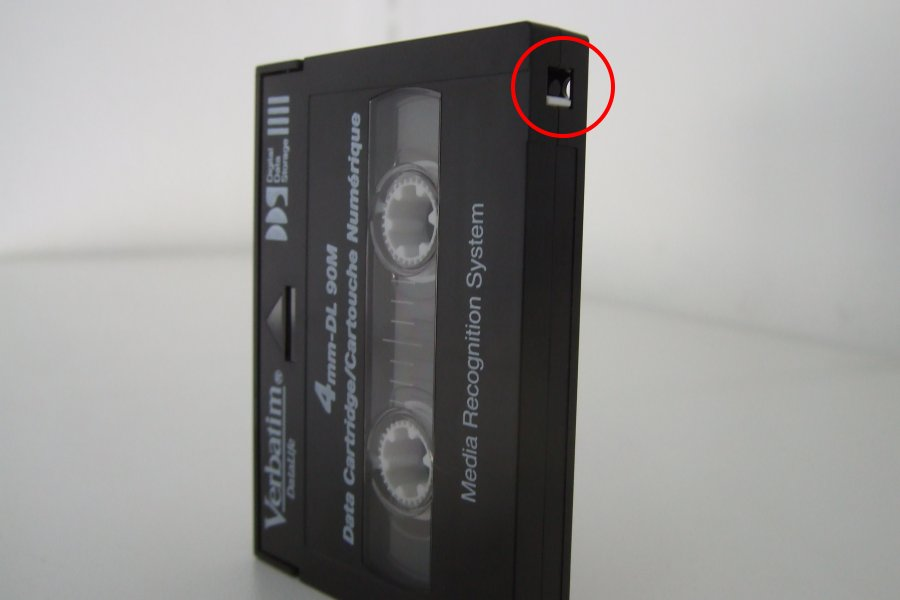

# DDS tape

## Introduction

[Digital Data Storage (DDS)](https://en.wikipedia.org/wiki/Digital_Data_Storage) is a family of tape formats that are based on [digital audio tape](https://en.wikipedia.org/wiki/Digital_audio_tape) (DAT).

## Hardware

### Tape reader

|**Model**|[HP SureStore DAT8](http://www.hp.com/ecomcat/hpcatalog/specs/S4112B.htm)|
|:--|:--|
|**Media**|DDS-2 (8 GB), DDS-1 (2.6 GB and 4 GB)|
|**Interface**|Single-ended, narrow SCSI-2|
|**Connector**|50-contact, centronics-type connector ("SCSI-1 Connector" AKA "Alternative 2, A-cable connector"), female (see also the topmost connector [here](http://www.paralan.com/sediff.html))[^1]|
|**Cable**|Attached to the device is a [Single Ended HD68 TO LD50 SCSI Cable](https://web.archive.org/web/20180606100950/http://www.itinstock.com/hp-c5665-61001-single-ended-hd68-to-ld50-scsi-cable-1-meter-40938-p.asp). The connector other end is a 68-pin DB68 (MD68) male connector (also known as High-Density or HD 68 and Half-Pitch or HP68)|
|**Workstation connection**|With this [HD68 to VHDCI adapter](https://web.archive.org/web/20181002103944/https://www.ramelectronics.net/sm-044-r.aspx) the reader can be hooked up to the workstation's SCSI controller (which has a female VHDCI connector)|

[^1]: This is somewhat strange, since the specs explicitly state the drive has a SCSI-2 interface

### SCSI controller

|**Model**|[Adaptec SCSI Card 29320LPE](https://storage.microsemi.com/en-us/support/scsi/u320/asc-29320lpe/)|
|:--|:--|
|**Bus System Interface Type**|[PCI Express](https://en.wikipedia.org/wiki/PCI_Express) x1|
|**External Connectors**|[68-pin VHDCI](https://en.wikipedia.org/wiki/Very-high-density_cable_interconnect)|
|**Data Transfer Rate**|Up to 320 MByte/sec.|

#### Note on bracket height

Note that by default the controller has a standard height (120 mm) bracket that won't fit into a low-profile (79.2 mm) slot! When these controllers were sold new, they came with a replacement low-profile bracket, but these are often not included with used ones. The low-profile replacement brackets are sometimes sold separately on eBay.

## Software

Additional software for working with tape devices:

    sudo apt install lsscsi

Software for translating Microsoft NTBackup stream (MTF) to TAR:

<https://sourceforge.net/projects/slackbuildsdirectlinks/files/mtftar/mtftar.tar.gz>

Download above TAR, extract to directory, go to directory and then build using:

    make

## General tape commands

List installed SCSI tape devices:

    lsscsi

Result:

    [0:0:2:0]    tape    HP       C1533A           A708  /dev/st0 
    [1:0:0:0]    disk    ATA      WDC WD2500AAKX-6 1H18  /dev/sda 
    [3:0:0:0]    cd/dvd  hp       DVD A  DH16ABSH  YHDD  /dev/sr0 
    [7:0:0:0]    disk    WD       Elements 25A2    1021  /dev/sdb

So our tape device is `/dev/st0`. For reading however we will use the " non-rewind" tape device which is `/dev/nst0`. The difference betweeen these devices:

- When using `/dev/st0`, the tape is automatically rewound after each read/write operation (e.g. using *dd*).
- When using `/dev/nst0`, the tape is left at its current position after each read/write operation.

The [*mt*](https://linux.die.net/man/1/mt) command is used for all tape operations. It must be run as root (so use *sudo*).
 
Display tape status:

    sudo mt -f /dev/st0 status

Result:

    drive type = 114
    drive status = 318767104
    sense key error = 0
    residue count = 0
    file number = 0
    block number = 0

Rewind tape:

    sudo mt -f /dev/st0 rewind

Eject tape:

    sudo mt -f /dev/st0 eject

## Loading a tape

1. Check the write-protect tab on the bottom of the tape, and slide it to
the open position:

    

2. Insert the tape into the drive. Make sure the printed side is on top, and that the tape is inserted in the direction of the arrow symbol:

    

## Identify tape archive format

Reas
    sudo dd if=/dev/nst0 of=header.dd bs=20k count=1

Then

## Note on dd usage

From [forensicswiki](https://www.forensicswiki.org/wiki/Dd):

> Having a bigger blocksize is more efficient, but if you use a 1MB block as an example and have a read error in the first sector, then dd will null fill the entire MB. Thus you should use as small a blocksize as feasible.
>
> But with linux if you go below 4KB blocksize, you can hit really bad performance issues. It can be as much as 10x slower to use the default 512 byte block as it is to use a 4KB block.
>
> Without noerror and sync, you basically don't have a forensic image. For forensic images they are mandatory.

> dd by itself does not hash, that is why the alternate command is provided. 

See also tape-specific comments in *Cautions* section!

## Make test tape

<strike>Do a short erase:

    sudo mt -f /dev/st0 erase 1 
</strike>

**NOTE** don 't do an erase (not even a short one) because it takes forever and the only way to stop it is a full system reboot!

Write two sessions:

    sudo tar -cvf /dev/nst0 /home/bcadmin/jpylyzer-test-files
    sudo tar -cvf /dev/nst0 /home/bcadmin/forensicImagingResources
    sudo tar -cvf /dev/nst0 /media/bcadmin/Elements/testBitCurator/testfloppy

Extract:

    sudo dd if=/dev/nst0 of=session1conv.dd bs=16384 conv=noerror,sync

Result: 46.5 MB file. When unpacking as tar the archives are incomplete and/or not readable!

Second attempt, omitting the *conv* swich:

    sudo dd if=/dev/nst0 of=session1conv.dd bs=16384

Result: 29.1 MB file. Unpacking as tar works!

From the [dd documentation](http://pubs.opengroup.org/onlinepubs/9699919799/utilities/dd.html):

> sync
>    Pad every input block to the size of the ibs= buffer, appending null bytes. (If either block or unblock is also specified, append <space> characters, rather than null bytes.)

A comparison of the 2 extracted files in a hex editor shows a block of around 6000 null bytes are inserted around offset 10240, adding about 6000 bytes. So let' s try the extraction with a block sixe of 10240 bytes:

    sudo dd if=/dev/nst0 of=session1convbs10240.dd bs=10240 conv=noerror,sync

Result: produces valid TAR archive of 29.1 MB. From the [tar docs](https://www.gnu.org/software/tar/manual/html_node/Blocking.html):

> In a standard tar file (no options), the block size is 512 and the record size is 10240, for a blocking factor of 20.

Solution: estimate block size by successively adding 512 bytes to start value.

TODO: 

- What if the actual block size is SMALLER than 4096 bytes (current start value)? Would assume that this would result in addition of padding bytes.

- What if the block sizes varie across tape sessions?

Try with ddrescue:

    sudo ddrescue -b 10240 -v /dev/nst0 session1.dd session1.log
    
## Block / record size tests

Write with 1024 byte record size:

    sudo tar -cvf /dev/nst0 -b2 /media/bcadmin/Elements/testBitCurator/testfloppy

Write with 4096 byte record size:

    sudo tar -cvf /dev/nst0 -b8 /media/bcadmin/Elements/testBitCurator/testfloppy

Write with 8192 byte record size:

    sudo tar -cvf /dev/nst0 -b16 /media/bcadmin/Elements/testBitCurator/testfloppy

## Procedure for reading an NTBackup tape

1. Load the tape

2. Determine the block size by entering:

        sudo dd if=/dev/st0 of=tmp.dd ibs=128 count=1

    If this results in a *Cannot allocate memory* error message, repeat the above command with a larger ibs value (e.g. 256). Repeat until the error goes away and some data is read. For instance:

        sudo dd if=/dev/st0 of=tmp.dd ibs=512 count=1

    Results in:

        1+0 records in
        1+0 records out
        512 bytes copied, 0.308845 s, 1.7 kB/s
    
    Which means that the block size is 512 bytes.

    An alternative method is described [here](https://www.linuxquestions.org/questions/linux-general-1/reading-%27unknown%27-data-from-a-tape-4175500596/#post5147408):

    > Easiest way to find the actual block size for a given file on the tape is to run
    >
    >   `dd if=/dev/nst0 of=/dev/null bs=64k count=1`
    >
    > and look at the number of bytes dd reports for that single block.
    >
    > Most basic way to compare:
    >
    >
    >   `cmp <(dd if=/dev/nst0 bs=32k) <(dd if=/dev/nst1 bs=32k) && echo OK`
    >
    > Adjust the block size as you wish, of course, as long as it is large enough.

 3. Read blocks (note that we're using the non-rewinding tape device ` /dev/nst0` here):

        for f in `seq 1 10`; do sudo dd if=/dev/nst0 of=tapeblock`printf "%06g" $f`.bin ibs=512; done

    Output:

        2251822+0 records in
        2251822+0 records out
        1152932864 bytes (1.2 GB, 1.1 GiB) copied, 5253.08 s, 219 kB/s
        1667+0 records in
        1667+0 records out
        853504 bytes (854 kB, 834 KiB) copied, 3.23535 s, 264 kB/s
        0+0 records in
        0+0 records out
        0 bytes copied, 0.0167298 s, 0.0 kB/s
        dd: error reading '/dev/nst0': Input/output error
        0+0 records in
        0+0 records out
        0 bytes copied, 0.00017777 s, 0.0 kB/s

    Question: why 10 iterations? What does each iteration represent (a backup session? something else?)

4. Rewind the tape:

        sudo mt -f /dev/st0 rewind

5. Eject the tape:

        sudo mt -f /dev/st0 eject

## Processing the extracted files

1. Join extracted files together using something like this:

        cat tapeblock000001.bin tapeblock000002.bin > tape.bin

## Resources

- [How to use the DAT-tape with Linux](http://www.cs.inf.ethz.ch/stricker/lab/linux_tape.html)

- [15 Useful Linux and Unix Tape Managements Commands For Sysadmins](https://www.cyberciti.biz/hardware/unix-linux-basic-tape-management-commands/)

- [Recovering NTBackup Tapes](https://www.108.bz/posts/it/recovering-ntbackup-tapes/)

- [Linux Set the Block Size for a SCSI Tape Device](https://www.cyberciti.biz/faq/rhel-centos-debian-set-tape-blocksize/)

- [Reading VMS tapes from Linux](https://www.tldp.org/HOWTO/VMS-to-Linux-HOWTO/x838.html)

- [Reading Tapes Written on Other Systems](http://www.astro.sunysb.edu/sysman/fits.html)

- [mtftar](https://github.com/sjmurdoch/mtftar) - mtftar is a tool for translating a MTF stream to a TAR stream

- [Microsoft™ Tape Format Specification Version 1.00a](http://laytongraphics.com/mtf/MTF_100a.PDF)

- [reading 'unknown' data from a tape](https://www.linuxquestions.org/questions/linux-general-1/reading-%27unknown%27-data-from-a-tape-4175500596/)

- [Copying Files and File Systems to Tape (Oracle documentation)](https://docs.oracle.com/cd/E19455-01/805-7228/6j6q7uf24/index.html) - explains pax, tar and cpio

- [How to copy data from DDS tape to UNIX station](https://community.hpe.com/t5/System-Administration/How-to-copy-data-from-DDS-tape-to-UNIX-station/td-p/4780851#.W9MEpxCxU3E)

- [Purpose of ibs/obs/bs in dd](https://stackoverflow.com/questions/1354938/purpose-of-ibs-obs-bs-in-dd) - one of the answers explains particular importance of block size in case of tapes

- [Duplicating a tape drive using dd ](https://www.linuxquestions.org/questions/linux-newbie-8/duplicating-a-tape-drive-using-dd-4175592839/) - more info on block size.

- [What does dd conv=sync,noerror do?](https://superuser.com/questions/622541/what-does-dd-conv-sync-noerror-do) - confirms that using these flags is generally a bad idea