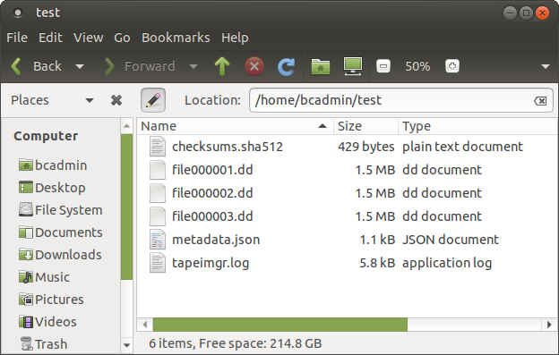

# DDS tape

## Introduction

[Digital Data Storage (DDS)](https://www.wikidata.org/wiki/Q1224723) is a family of tape formats that are based on [digital audio tape](https://www.wikidata.org/wiki/Q597615) (DAT).

## Hardware

### Tape reader

|**Model**|[HP SureStore DAT8](https://web.archive.org/web/20180606153928/http://www.hp.com/ecomcat/hpcatalog/specs/S4112B.htm)|
|:--|:--|
|**Media**|DDS-2 (8 GB), DDS-1 (2.6 GB and 4 GB)|
|**Interface**|Single-ended, narrow SCSI-2|
|**Connector**|50-contact, centronics-type connector ("SCSI-1 Connector" AKA "Alternative 2, A-cable connector"), female (see also the topmost connector [here](https://web.archive.org/web/20180606154144/http://www.paralan.com/sediff.html))[^1]|
|**Cable**|Attached to the device is a [Single Ended HD68 TO LD50 SCSI Cable](https://web.archive.org/web/20180606100950/http://www.itinstock.com/hp-c5665-61001-single-ended-hd68-to-ld50-scsi-cable-1-meter-40938-p.asp). The connector other end is a 68-pin DB68 (MD68) male connector (also known as High-Density or HD 68 and Half-Pitch or HP68)|
|**Workstation connection**|With this [HD68 to VHDCI adapter](https://web.archive.org/web/20181002103944/https://www.ramelectronics.net/sm-044-r.aspx) the reader can be hooked up to the workstation's SCSI controller (which has a female VHDCI connector)|
|**Documentation**|<ul><li>[HP Surestore and StorageWorks DAT - HP DAT Accessories and Part Numbers](https://web.archive.org/web/20181101135618/https://support.hpe.com/hpsc/doc/public/display?docId=emr_na-lpg50205)</li><li>[HP SureStore DAT - Sun Workstation Configuration](https://web.archive.org/web/20181101140041/https://support.hpe.com/hpsc/doc/public/display?docId=emr_na-lpg51069)</li><li>[HP StorageWorks DAT - Troubleshooting for HP StorageWorks DAT8, DAT24, DAT40, DAT72, and DAT160  SCSI and USB Devices](https://web.archive.org/web/20190128155319/https://support.hpe.com/hpsc/doc/public/display?docId=emr_na-c00057819)</li></ul>|

[^1]: This is somewhat strange, since the specs explicitly state the drive has a SCSI-2 interface

### SCSI controller

|**Model**|[Adaptec SCSI Card 29320LPE](https://web.archive.org/web/20161203082125/https://storage.microsemi.com/en-us/support/scsi/u320/asc-29320lpe/)|
|:--|:--|
|**Bus System Interface Type**|[PCI Express](https://www.wikidata.org/wiki/Q206924) x1|
|**External Connectors**|[68-pin VHDCI](https://www.wikidata.org/wiki/Q4052507)|
|**Data Transfer Rate**|Up to 320 MByte/sec.|

#### Note on bracket height

Note that by default the controller has a standard height (120 mm) bracket that won't fit into a low-profile (79.2 mm) slot! When these controllers were sold new, they came with a replacement low-profile bracket, but these are often not included with used ones. The low-profile replacement brackets are sometimes sold separately on eBay.

### Connecting / disconnecting the tape reader

Always make sure that both the tape reader and the computer are switched off before connecting or disconnecting. Not doing so may cause damage to the computer, the tape reader or both.

## Software

[tapeimgr](https://github.com/KBNLresearch/tapeimgr), running in [BitCurator](https://bitcurator.net/).

## Procedure for reading a tape

1. Check the write-protect tab on the bottom of the tape, and slide it to
the open position:

    

2. Insert the tape into the drive. Make sure the printed side is on top, and that the tape is inserted in the direction of the arrow symbol:

    

3. Create an empty directory for storing the extracted tape contents.

4. Start *tapeimgr* from the OS's main menu (in Ubuntu 18.04 the *tapeimgr* item is located under *System Tools*), or by clicking the *tapeimgr* shortcut on the desktop.

    

5. Use the *Select Output Directory* button to navigate to the empty directory created under step 3. Click on the *UUID* button to generate a unique identifier. Use the *Description* field to enter a description of the tape (e.g. the title that is written on its label or inlay card). Optionally, use the *Notes* field to record anything else worth mentioning about the tape (e.g. if the *Description* is ambiguous because the writing on the tape's label is illegible, make a note of it here).

6. Press the *Start* button to start the extraction, and then wait for *tapeimgr* to finish (depending on the amount of data on the tape this may take several hours). You can monitor the progress of the extraction procedure in the progress window:

    

    Note that the screen output is also written to a log file in the output directory. A prompt appears when the extraction has finished:

    

    If the extraction finished without any errors, the output directory now contains the following files:

    

    Here, **file000001.dd** through **file000003.dd** are the extracted files; **checksums.sha512** contains the SHA512 checksums of the extracted files, **metadata.json** contains some basic metadata and **tapeimgr.log** is the log file.

7. The tape is automatically ejected when *tapeimgr* has finished. All done!