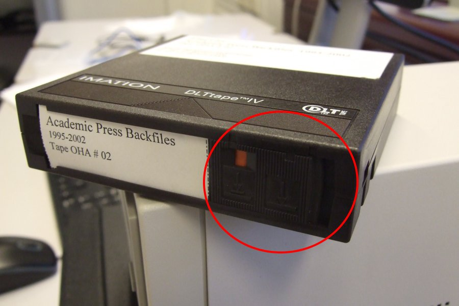
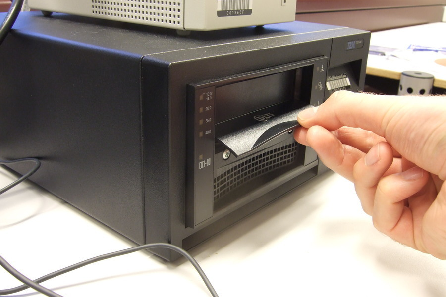
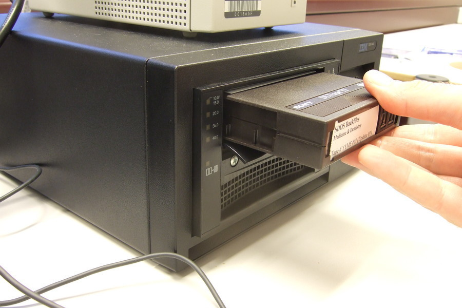
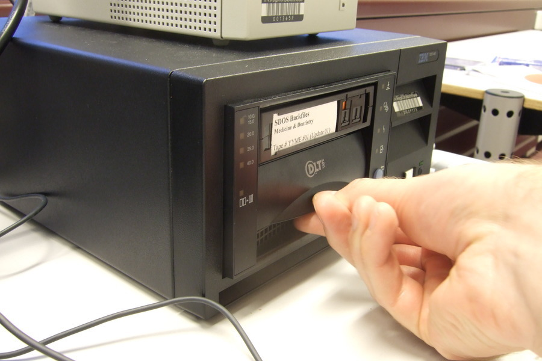
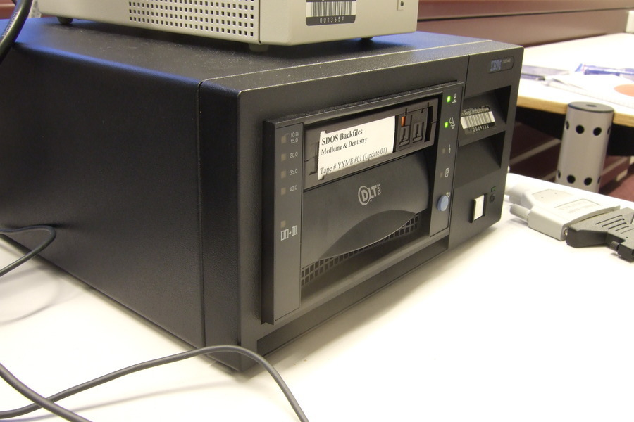
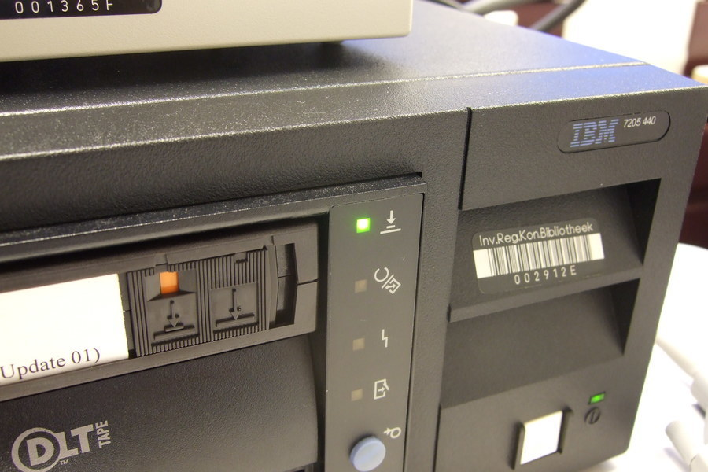
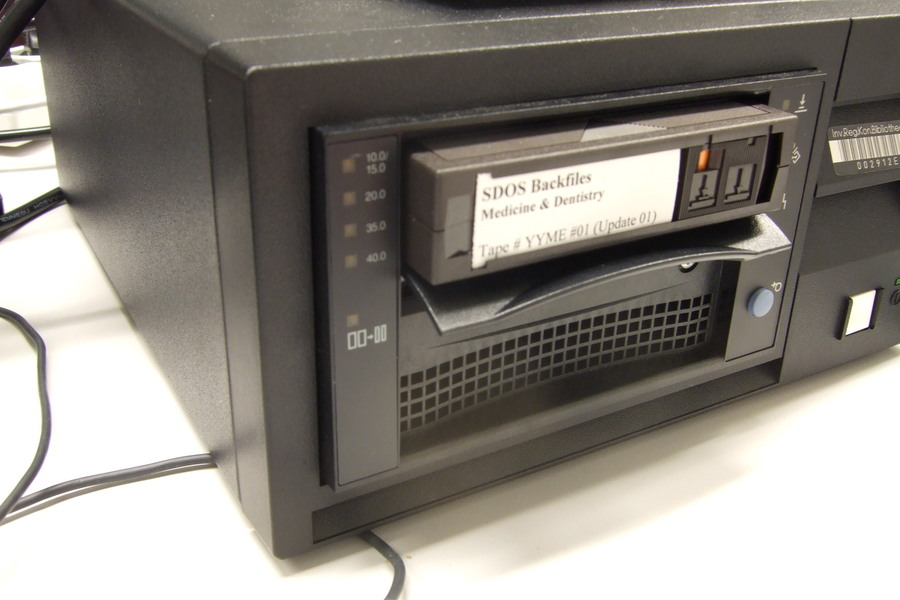

# DLT-IV tape

## Introduction

[Digital Linear Tape (DLT)](https://www.wikidata.org/wiki/Q1224765) is is a family of tape formats that were developed by Digital Equipment Corporation (DEC) from 1984 onwards.

## Hardware

### Tape reader

|**Model**|[IBM 7205 440](https://web.archive.org/web/20181101132449/https://www-01.ibm.com/common/ssi/cgi-bin/ssialias?infotype=DD&subtype=SM&htmlfid=649/ENUS7205-440)|
|:--|:--|
|**Media**|DLT IV (and possibly DLT III)|
|**SCSI Signaling Type**|Low Voltage Differential (LVD)|
|**Interface**|Fast Wide SCSI|
|**Connector**|68 pin HD D-Sub (HD-68) (see also 5th from top [here](http://www.paralan.com/sediff.html))|
|**Cable**|At the outgoing side is a male VHDCI SCSI connector (bottommost [here](http://www.paralan.com/sediff.html))|
|**Workstation connection**|Can be connected directly with workstation's SCSI controller (which has a female VHDCI connector)|
|**Documentation**|<ul><li>[IBM 7205 Model 440 40 GB External Digital Linear Tape  Drive  Enhances  Data  Storage](https://web.archive.org/web/20181101131555/https://www-01.ibm.com/common/ssi/rep_ca/2/897/ENUS101-062/ENUS101-062.PDF)</li><li>[7205 Model 440 Digital Linear Tape Drive Setup and Operator Guide](https://web.archive.org/web/20181101132208/http://ps-2.kev009.com/basil.holloway/ALL%20PDF/a4100501.pdf)</li></ul>|

### SCSI controller

|**Model**|[Adaptec SCSI Card 29320LPE](https://web.archive.org/web/20161203082125/https://storage.microsemi.com/en-us/support/scsi/u320/asc-29320lpe/)|
|:--|:--|
|**Bus System Interface Type**|[PCI Express](https://www.wikidata.org/wiki/Q206924) x1|
|**External Connectors**|[68-pin VHDCI](https://www.wikidata.org/wiki/Q4052507)|
|**Data Transfer Rate**|Up to 320 MByte/sec.|

#### Note on bracket height

Note that by default the controller has a standard height (120 mm) bracket that won't fit into a low-profile (79.2 mm) slot! When these controllers were sold new, they came with a replacement low-profile bracket, but these are often not included with used ones. The low-profile replacement brackets are sometimes sold separately on eBay.

## Connecting / disconnecting the tape reader

Always make sure that both the tape reader and the computer are switched off before connecting or disconnecting. Not doing so may cause damage to the computer, the tape reader or both.

## Procedure for reading a tape

1. Check the write-protect tab on the bottom of the cartridge, and slide it to the leftmost position. The orange indicator must be visible:

    

2. Lift the cartridge insert/release handle:

    

3. Insert the tape cartridge into the drive. Make sure the printed side is on top, and that the tape is inserted in the direction of the arrow symbol:

    

4. Lower the cartridge insert/release handle:

    

    The loaded tape should now look like this:

    

    The green "tape in use" indicator light (2nd from the top) now starts blinking. Once the tape is completely loaded the blinking stops and the indicator light is lit solid.

5. Check that the green "write-protected" indicator light (top-right) is lit:

    

6. Create an empty directory that will be used to store the extracted tape contents.

7. Open this directory in a terminal window, and run the [tape extraction script](../scripts/readtape.sh). The script must be run as superuser (sudo). The following command runs the script with default options:

        sudo ~/scripts/readtape.sh .

    Now wait for the script to finish (depending on the amount of data on the tape this may take several hours).

10. When the script is finished, wait until the "tape in use" indicator light stops blinking. Now lift the cartridge insert/release handle:

    

11. Take out the tape cartridge. All done!

## Resources

- [Write protect in DLT IV Data cartridge](https://web.archive.org/web/20181031154114/https://community.hpe.com/t5/StoreEver-Tape-Storage/Write-protect-in-DLT-IV-Data-cartridge/td-p/129718https://community.hpe.com/t5/StoreEver-Tape-Storage/Write-protect-in-DLT-IV-Data-cartridge/td-p/129718)