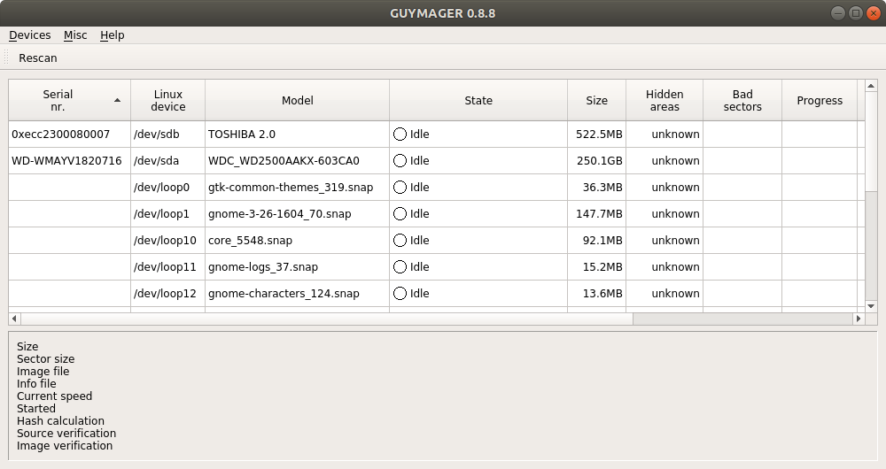
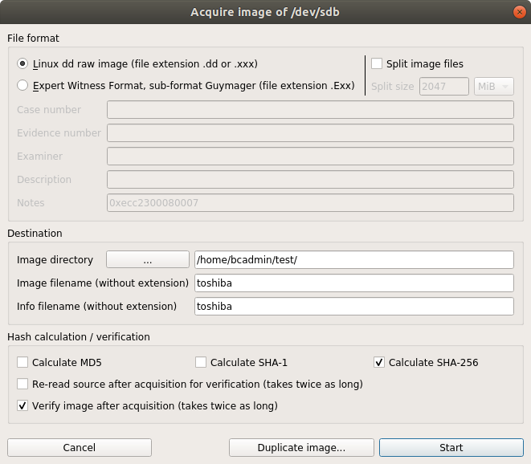
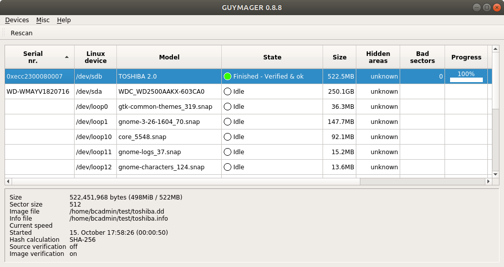
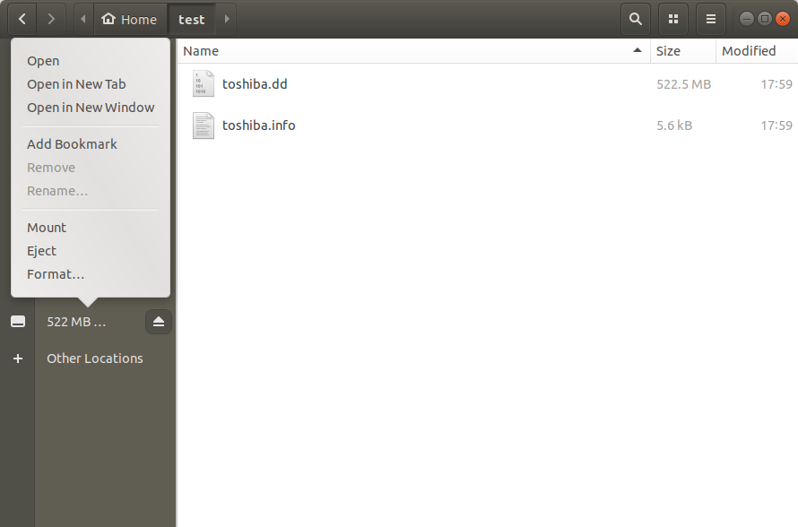

# USB flash drive

## Introduction

[USB flash drive](https://en.wikipedia.org/wiki/USB_flash_drive) .

## Hardware

### Write blocker

|**Model**|[Tableau Forensic USB 3.0 Bridge](https://www.guidancesoftware.com/tableau/hardware/t8u)|
|:--|:--|
|**Connectors: Host (Left) Side**|USB 3.0 Standard-B connector|
|**Connectors: Device (Right) Side**|USB 3.0 Standard-A connector|

## Connecting the write blocker

1. Hook up the write blocker to the workstation using the blue USB cable (use the left-hand port on the write blocker).

2. Connect the write blocker' s power supply to the DC In (at top) and make sure the power cord is plugged into to a power socket.

## Procedure for creating a disk image

### Guymager

1. Press the power button on the write blocker (if it is not switched on already).

2. Connect the flash drive to the right-hand USB connector on the write blocker.

3. Start Guymager. Result:

    

4. Right-click on the entry for the flash drive, and select *Acquire image*.

5. In the *Acquire image* dialog, make the following settings:

    - Set *File format* to *Linux dd raw*.
    - Uncheck the *Split image files* checkbox.
    - Select the destination directory for the disk image, and enter a file name (without extension).
    - Check *Calculate SHA-256* (and uncheck the *MD5* and *SHA-1* options).
    - Check *Verify image after acquisition*.

    

6. Press the *Start* button and watch the progress indicator.

7. If all went well, the *State* field will read *Finished - Verified & ok*.

    

The above steps result in two files:

- A file with extension *.dd*, which is the actual disk image.
- A file with extension *.info*, which contains information about the imaging process.

8. Open a file manager window, right-click on the flash drive icon, and select *Eject*.

    

9. You can now safely remove the flash drive from the write blocker.
